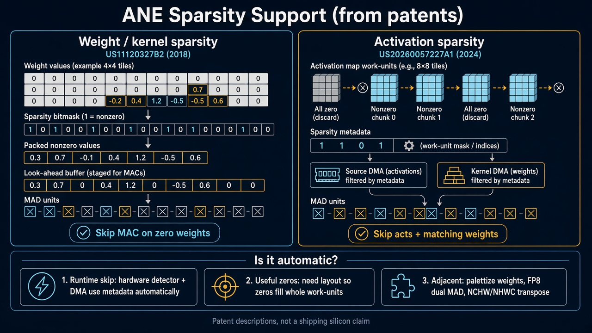

# Core AI GEMM check: FP16, FP8 and INT8 on GPU and ANE

Runs the same GEMM as the Metal bench one directory up, but through Apple Core AI, to check which FP16, FP8 and INT8 throughput Core AI reaches on the GPU and on the Neural Engine:

```
Y[N, M] = X[N, K] @ W[K, M]      nn.Linear(K, M, bias=False)
```

Pipeline: torch module → `coreai-opt` quantization → `torch.export` → `coreai-torch` → `.aimodel` → `xcrun coreai-build compile --preferred-compute {gpu,neural-engine} --architecture <this Mac>` → `.aimodelc` → `coreai.runtime.AIModel` loaded with the same preferred compute unit.

| dtype | weights | activations | coreai-opt config |
|---|---|---|---|
| `fp16` | FP16 | FP16 | none |
| `fp8` | FP8 E4M3, per-tensor | FP16 | weight-only |
| `f8f8` | FP8 E4M3, per-tensor | FP8 E4M3, per-tensor | weight + activation |
| `int8` | INT8, per-channel | FP16 | weight-only |
| `i8i8` | INT8, per-channel | INT8, per-tensor | weight + activation |

## How the TFLOPs are measured

Core AI only allows wall-clock timing around the inference call, and each call costs about 1 ms of fixed overhead. On a 4096³ FP16 GEMM that overhead alone cuts the apparent rate from 65 to 47 TFLOPs. So each row runs two models: one with a single GEMM (`S=1`) and one with `S` chained GEMMs of the same shape. The table reports the slope:

```
T(S) ≈ T_call + S * T_gemm        T_gemm = (T(S) - T(1)) / (S - 1)
tflops = 2*N*K*M / T_gemm         t1_tf = 2*N*K*M / T(1)
```

Chained GEMMs need `K == M`, so the slope is only available on `square`. `fat` rows fall back to `S=1`, and the row says so.

`rel_err` compares the S=1 output with an FP32 torch reference (`max|y-ref| / max|ref|`). A row is marked `BAD` if the error exceeds the dtype's tolerance.

## Where it ran (`placed`)

Core AI has no ANE-only option. `--preferred-compute neural-engine` is a preference, and the compiler may place the graph on the GPU instead. The compiled package shows where it went: an `ANE_region*.bc` bundle together with `mps.fullyPlacedOnANE` / `mps.noGPUActivity` in the MPSGraph manifest means `ANE`. No ANE region means `GPU`. Every row reports that placement, and ANE rows that did not land on the ANE carry a note.

`matmul` is the exported IR pattern (`w=<weight storage> a=<activation quant>`). `coreai-torch` always emits an f16 × f16 `broadcasting_batch_matmul`, with `blockwise_shift_scale` dequantizing the weights and a `quantize → dequantize` pair on the activations. Whether that fuses into a native low-precision matmul is up to the backend compiler, so the timing is the evidence.

## Run

Needs macOS 27+ with the OS Core AI framework, Xcode's `coreai-build`, and `uv`. Do not set `USE_LOCAL_COREAI`: the in-wheel runtime cannot select GPU or ANE.

```bash
cd coreai
uv sync
./run.sh --shapes smoke --stack 4          # 256³, all dtypes, GPU + ANE, ~30 s
./run.sh --shapes square --stack 8         # 4096³, the reference numbers below
./run.sh --dtypes fp16,i8i8 --compute ane --shapes square --json out.json
```

Exported and compiled models are cached in `artifacts/` by dtype, shape and S. Pass `--force` to rebuild them. The device architecture (`h17c` on M5 Max) is detected once by compiling a tiny model for all architectures and inspecting it. Set `COREAI_ARCH` to skip that step.

## Tests

```bash
uv run pytest -m "not device"   # unit: fit, TFLOPs math, IR labels, placement parsing
uv run pytest                   # + on-device: every dtype on GPU and ANE at 256³ (~15 s warm)
```

The device tests check that each dtype exports, compiles, runs and matches the FP32 reference on both compute units. They also check that GPU rows are placed on the GPU, that FP16 with ANE preferred lands on the ANE, and that each dtype's IR has the expected weight and activation types.

## M5 Max (Mac17,6, 40-core GPU), square 4096³, S=8

Full log: [`result_m5max_square.txt`](result_m5max_square.txt).

```
shape       N     K     M dtype compute placed    S    t1_ms     tS_ms  gemm_ms  tflops   t1_tf  rel_err status matmul
----------------------------------------------------------------------------------------------------------------------
square   4096  4096  4096 fp16  gpu     GPU       8    2.947    17.690    2.106   65.25   46.64  4.7e-04 OK     w=fp16 a=fp16
square   4096  4096  4096 fp8   gpu     GPU       8    3.029    18.837    2.258   60.86   45.38  2.6e-02 OK     w=fp8 a=fp16
square   4096  4096  4096 f8f8  gpu     GPU       8    4.368    27.311    3.278   41.93   31.47  5.5e-02 OK     w=fp8 a=fp8
square   4096  4096  4096 int8  gpu     GPU       8    2.864    17.731    2.124   64.71   47.99  9.1e-03 OK     w=int8 a=fp16
square   4096  4096  4096 i8i8  gpu     GPU       8    3.725    24.467    2.963   46.38   36.89  1.7e-02 OK     w=int8 a=int8
square   4096  4096  4096 fp16  ane     ANE       8   15.015   109.499   13.498   10.18    9.15  5.3e-04 OK     w=fp16 a=fp16
square   4096  4096  4096 fp8   ane     GPU       8    3.046    18.825    2.254   60.97   45.12  2.6e-02 OK     w=fp8 a=fp16  # ANE requested, not placed on ANE
square   4096  4096  4096 f8f8  ane     GPU       8    4.303    27.116    3.259   42.17   31.94  5.5e-02 OK     w=fp8 a=fp8  # ANE requested, not placed on ANE
square   4096  4096  4096 int8  ane     ANE       8   12.883    65.400    7.502   18.32   10.67  9.1e-03 OK     w=int8 a=fp16
square   4096  4096  4096 i8i8  ane     GPU       8    4.159    24.171    2.859   48.08   33.05  1.7e-02 OK     w=int8 a=int8  # ANE requested, not placed on ANE
```

Compared with the Metal `matmul2d` bench on the same machine (`../result_m5max_autotune.txt`):

| dtype | operands | Metal GPU | Core AI GPU | Core AI ANE |
|---|---|---:|---:|---:|
| fp16 | fp16 × fp16 | 63.8 | **65.3** | **10.2** |
| fp8 | fp16 act × fp8 weight | 64.3 | 60.9 | not placed (runs on GPU) |
| f8f8 | fp8 × fp8 | 64.9 | 41.9 | not placed (runs on GPU) |
| int8 | fp16 act × int8 weight | 62.7 | 64.7 | **18.3** |
| i8i8 | int8 × int8 | **122.6** | 46.4 | not placed (runs on GPU) |

The ANE `int8` number (18.3) is INT8 weights with FP16 activations, not INT8×INT8. There is no Core AI ANE number for INT8×INT8. See the ANE note below.

- **FP16 on the GPU confirms the peak.** Once call overhead is removed, Core AI reaches 65 TFLOPs, the same Neural Accelerator ceiling the Metal bench and `tune/peak.metal` found. The one-call number (47) is what a single-op model sees.
- **Weight-only FP8 and INT8 run at the FP16 rate on the GPU** (61–65). The weight is dequantized and the matmul runs at the FP16 rate. That matches Metal, where FP8 has no compute advantage over FP16.
- **Core AI does not produce a native INT8×INT8 matmul.** `i8i8` reaches 46 TOPS against 122 in Metal, below FP16. If the backend had lowered it to an integer matmul, it would beat FP16. Instead it is about 1.4× slower, which fits an f16 matmul with the activation `quantize → dequantize` pair adding cost around it. `f8f8` behaves the same way (42).
- **For this `nn.Linear` GEMM, the ANE takes FP16 and INT8 weights only.** FP16 runs at about 10 TFLOPs and W8A16 INT8 at 18. The INT8 speedup suggests the ANE is limited by weight bandwidth on this shape. FP8 in any form, and INT8 activations, are not placed on the ANE even when it is preferred. They compile to the GPU and time like the GPU rows. This covers the matmul lowering only. Other graph shapes, such as conv chains, were not tested here.
- **No INT8×INT8 `nn.Linear` GEMM on the ANE through Core AI today.** Five W8A8 configs were tried at 256³ with the ANE preferred: per-channel or per-tensor weights, with activations quantized at the input only or at the input and output, plus the default `QuantizerConfig()` (`probe_i8i8_ane.py`). All five compiled to the GPU. INT8 weights alone go to the ANE, so the activation `quantize` op appears to be what the ANE compiler rejects (coreai-opt 0.2.1, coreai-torch 0.4.2, coreai-build 3605.5.4).
- **The handoff's "ANE FP8 ≈ 42 TFLOPs" was GPU.** Those `.aimodelc` packages had no ANE region.

Caveats: timings are host wall-clock (median of 10 after 3 warmup), not GPU timestamps. The slope assumes the S GEMMs in one call run back-to-back with no extra per-layer cost. For `f8f8` and `i8i8`, the per-layer activation quantize/dequantize is counted in `T_gemm`, since it is part of the real layer cost. This is a laptop, so rerun a single row if it looks low.

## ANE FP8 conv-chain: 72 TFLOPs on M6 (reproduce)

> **The 72 TFLOPs here is a zero-activation number.** `bench_stacked.py` uses PyTorch's default `nn.Linear` init, which shrinks activations at every layer. After 256 layers every activation is exactly 0 (the output is 0 in all 2,097,152 elements), and the ANE runs faster on zeros. With dense random activations the same chain runs at **about 57 TFLOPs**. See [ANE sparsity](#ane-sparsity-what-the-72-tflops-needs) below.

`bench_stacked.py` packs `S` sequential bias-free `nn.Linear(ch, ch)` layers into one `.aimodel`. A 1×1 conv over `N = sp·sp` activations is identical to `nn.Linear(ch, ch)`, so `--shapes conv512` is `N=4096, K=512, M=512` (`sp=64`). `f8f8` is FP8 E4M3FN weights **and** activations (symmetric per-tensor) → IR `dequant → fp16 broadcasting_batch_matmul`. In the IR, FP8 is the 1-byte storage format and the matmul operands are FP16. On dense data, though, `f8f8` still runs about 1.8× faster than `fp16` on the ANE, so the backend compiler gains something from FP8 below the IR (FP8 MACs or halved activation traffic; the IR doesn't show which).

Confirmed on **Apple M6** (Mac18,5), ANE preferred:

| config | dtype | ms | TFLOPS |
| --- | --- | ---: | ---: |
| conv512, 256×512 (256 layers) | f8f8 | **7.5988** | **72.35** |
| conv512, 128×512 (128 layers) | f8f8 | 5.3845 | 51.05 |
| conv512, 128×512 (128 layers) | fp16 | 7.5406 | 36.45 |

`TFLOPS = 2·N·K·M·S / wall_clock`; `256×512` = **256 layers × 512 channels**. FP8 is **1.87×** FP16 at 128 layers.

Reproduce:

```bash
cd coreai
unset USE_LOCAL_COREAI
uv run python bench_stacked.py --compute ane --dtypes f8f8 --shapes conv512 --stacks 256
```

Or use the wrapper, which defaults to the same row and prints a clean table (`dtype shape S median_ms status tflops`):

```bash
./bench_ane.sh                 # conv512, 256 layers, f8f8, ANE ~72 TFLOPs
./bench_ane.sh --stacks 128    # 128 layers
./bench_ane.sh --compute gpu --stacks 256   # GPU comparison
```

`--compute ane` is preference-only, but placement is real on M6: the same `conv512` S=256 `f8f8` config with `--compute gpu` ran **27.47 ms / 20.02 TFLOPS**, so the ANE row is **3.60×** faster. Results are written to `results_stacked_ane.txt` and `results.md`; assets are cached in `artifacts_stacked/`.

Note: this is a chip difference from the M5 Max section above, where `f8f8` did **not** specialize on the ANE and fell back to the GPU. On M6 the FP8 chain lands on the ANE.

All rows in the table above ran with all-zero activations (default init), including the 128-layer FP16 row.

## ANE sparsity: what the 72 TFLOPs needs



The mechanisms above come from patent descriptions, not a confirmed description of shipping silicon. In the patents, weight zeros are packed out and skipped at the MAC. Activation zeros are skipped per work-unit tile, only when a whole tile is zero. The measurements below fit the weight side well. On the activation side, zeros scattered at random still sped things up, even though they rarely fill a whole tile. That suggests part of the activation gain comes from power or clock rather than skipped tiles.

`bench_sparsity.py` runs a real `nn.Conv2d(512, 512, 1)` chain: input `(1, 512, 64, 64)`, 256 layers, the same work as `conv512`, with the IR lowering to `coreai.conv2d`. The weights are orthogonal, so activations keep unit scale through all 256 layers instead of decaying to zero. Each mode controls where the zeros are:

| mode | what is zero |
|---|---|
| `plain:0` | nothing: dense random activations |
| `zero:0` | the input, so every activation is 0 |
| `act:P` | fraction `P` of activations at **every** layer (conv + bias + ReLU, bias calibrated per layer, rescaled to unit RMS) |
| `w:P` | fraction `P` of weights, random positions |
| `w24:P` | `P` of every 4 consecutive input-channel weights (structured) |

TFLOPS is dense-equivalent: `2·N·C·C·S / wall_clock`, with zeros counted as work.

Apple M6, ANE preferred, conv512, 256 layers, median of 50:

| dtype | mode | zero % | ms | TFLOPS |
|---|---|---:|---:|---:|
| fp16 | plain | 0 | 17.144 | 32.07 |
| fp16 | zero | 100 | 14.215 | 38.67 |
| f8f8 | **plain** | **0** | **9.335** | **58.89** |
| f8f8 | zero | 100 | 7.676 | 71.62 |
| f8f8 | act | 0 | 9.013 | 61.00 |
| f8f8 | act | 25 | 8.889 | 61.85 |
| f8f8 | act | 50 | 8.543 | 64.35 |
| f8f8 | **act** | **75** | **7.656** | **71.81** |
| f8f8 | act | 90 | 7.732 | 71.10 |
| f8f8 | w | 50 | 6.944 | 79.17 |
| f8f8 | w | 75 | 6.007 | 91.52 |
| f8f8 | w24 | 50 | 7.007 | 78.45 |

- **Dense FP8 conv2d is about 57–59 TFLOPs**, 1.8× dense FP16 (32).
- **72 TFLOPs needs about 75% zero activations** (3 of every 4). Speed rises from 0% to 75% zeros, then flattens at about 72; 90% and 100% zeros are no faster.
- **Zero weights go past that plateau.** 75% zero weights reach 92 TFLOPs dense-equivalent. That points to the ANE skipping zero-weight work outright, and random zeros do about as well as 2-of-4 structured ones.
- **For activations, skipping and power savings look the same from here.** Zeros may be skipped, or may just draw less power so the clock stays higher; the flat top at about 72 fits a clock or pipeline limit. Not confirmed.
- **The `act:0` row (61) is slightly faster than `plain` (59).** Its activations are all positive after the ReLU, which probably toggles fewer bits.
- **Making the work bigger doesn't reach 72 on dense data.** An ad-hoc sweep with random input (not in the repo) measured 52–55 TFLOPs for 768 or 1024 channels, 64×128 spatial, batch 2, and two independent parallel chains in one model. With zero input, the same shapes reached 71–76. Larger dense runs got slower, not faster, which points to a power or clock limit rather than unused capacity.
- `conv2d` and `nn.Linear` (matmul) chains time the same, in both `f8f8` and `fp16`.

Timings vary by 5–10% with temperature. After about 15 minutes of back-to-back ANE runs, `plain` measured 54.5 and `act:0.75` measured 67.6. Let the machine cool before comparing rows.

Reproduce:

```bash
cd coreai
./bench_sparsity.sh                               # full f8f8 sweep above (~3.5 min cold, models cached after)
./bench_sparsity.sh plain:0 act:0.75              # pick modes, MODE:P with P = zero fraction
./bench_sparsity.sh --dtype fp16 plain:0 zero:0   # FP16 baseline
./bench_sparsity.sh --stack 128 act:0.5           # other depths
```

Models are cached in `artifacts_sparsity/`; pass `--force` to rebuild them.
